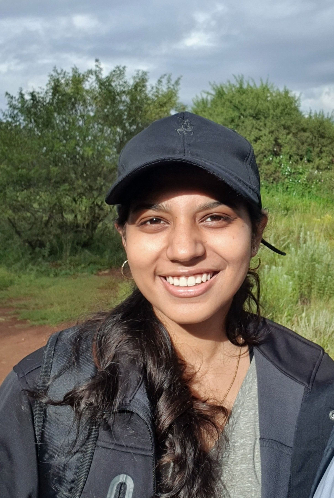

# Carpool

## Description

This is a React Native application that helps students find and join safe car trips, e.g., short trips to/from campus or longer trips to return home for the holidays.

## Documentation

<a href="https://drive.google.com/file/d/13NRuYgyNQXT4404feg_0ihbTP1nUzH4M/view?usp=sharing" target="_blank">🧾 SRS Document</a>

<a href="https://drive.google.com/file/d/1xDOdy1RuHcaD6bfZmXEQi1v0jDKA4_tx/view?usp=sharing">🧾 Architectural Requirements</a>

<a href="https://drive.google.com/file/d/10vLudJuCEjTIOc-Y64HBErKkccoEbQKg/view?usp=sharing">🧾 Coding Standards</a>

<a href="https://drive.google.com/file/d/1RQiF0iWuFpJU-yRYtyXHXKCDW9ErpASP/view?usp=sharing">🧾 User Manual</a>

<a href="https://drive.google.com/file/d/10CfyeI85WhfIcqb0Q5il0g91pX3w3iX8/view?usp=sharing">🧾 Technical Installation Manual</a>

<a href="https://drive.google.com/file/d/10CfyeI85WhfIcqb0Q5il0g91pX3w3iX8/view?usp=sharing">🧾 Testing Policy Document</a>

## Demo Recordings

<a href="https://drive.google.com/file/d/1Ygoif67u4aPwdwbWmDB1_o0UsMAF9qAe/view?usp=sharing">📽️ Demo 1</a>

<a href="https://drive.google.com/file/d/1XLrvGDelzesQ-VT_03pnAnkyqUJ_8pdu/view?usp=sharing">📽️ Demo 2</a>

<a href="https://drive.google.com/file/d/1sVPunCSwj_sstIsVSUmqxh_izvDj1w5E/view?usp=sharing">📽️ Demo 3</a>

<a href="https://drive.google.com/file/d/15h2_j-15hWvcnrrnIazgvl83A2R40jvB/view?usp=sharing">📽️ Demo 4</a>

## Project Management

<a href="https://sharing.clickup.com/37420985/b/h/7-37420985-2/25fa8bdbe2fe460">📅 Project Board</a>

## Team Members

 **Team Member**    | **Description**     |    |
|---------------------------------------|--------------------|--------------------|
|     **Benjamin Osmers**  |Team Lead.   Mechanical Engineering graduate (BEng, 2019) and current final year Multimedia (BIS) student at the University of Pretoria. During 2019-2021, I ran my own web development company alongside my studies. During which I developed various websites and web apps, mostly focusing on E-Commerce stores. Most of the projects were built using the MERN development stack: MongoDB (or MySQL), Express, React, Node.js. Email: dev@benjaminosmers.co.za  |     |
|    **Jason Antalis**  |Final year BSc Computer Science student at the University of Pretoria, having done small web projects on the side. Email: jason.antalis@gmail.com|     |
|    **Wesley Pachai**  |Final year BSc Computer Science student at the University of Pretoria with small web development projects done. Email: pachaiwesley@gmail.com|     |
|    **Asheigh Govender**  |Final year BSc Computer Science student at the University of Pretoria. I have some experience in web development. Email: ashleighgovender633@gmail.com  |     |

## Extra Information
All other information regarding the project can be found on the [wiki page](https://github.com/COS301-SE-2022/Carpool/wiki)
